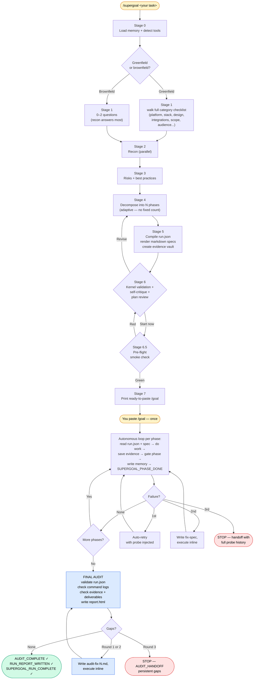
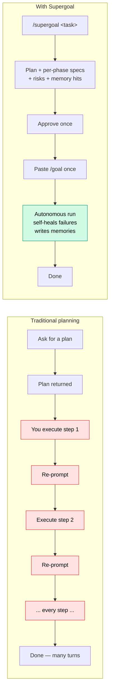

# Supergoal

Plan deeply, then autonomously build until the run contract is satisfied.

`/supergoal <what you want>` recons your codebase, applies saved preferences from memory, decomposes the work into the right number of phases, writes a structured `run.json` contract, gets one confirmation from you, then prints a **single ready-to-paste `/goal` command**. Paste it once and the rest is autonomous: every phase runs sequentially with event telemetry, evidence files, mechanical phase gates, retry, fix-spec recovery, memory writeback, final audit, and a local `report.html` until `SUPERGOAL_RUN_COMPLETE`.

Works on **Claude Code** and **Codex** (Codex CLI).

## How it works (at a glance)



Yellow = the only steps you do. Blue = the final audit that re-checks against your original plan. Green = success terminal (audit clean). Red = blocker handoff. Everything else is autonomous.

## How it's different



Two human touches total: one approval, one paste. The plan is **deeper** than a one-shot plan (recon, risk list, memory-informed phase shaping, validated specs) and the execution is **autonomous** instead of step-by-step babysitting.

## Why one `/goal` (not a chain)

`/goal` on both hosts takes a short **end-state condition** that an evaluator checks against the transcript after each turn — not a long task body. Supergoal leverages this directly: one `/goal` covers the whole run; phase work lives in files the agent reads from disk. No char budget, no inter-session chain, no fragility.

Slash commands only fire from user input, so Stage 7 is an honest one-paste handoff: the planner prepares the `/goal` line, you paste it, the autonomous run starts. From there it drives itself to completion.

## Install — Claude Code

Three commands inside a Claude Code session:

```text
/plugin marketplace add https://github.com/robzilla1738/supergoal.git
/plugin install supergoal@supergoal
/reload-plugins
```

That's it. `/supergoal` is available immediately. Plugin install was verified end-to-end against the live repo (installs as `supergoal@supergoal`, ~307 tokens always-on + ~10k on-invoke).

> **Tip:** the `owner/repo` shorthand (`/plugin marketplace add robzilla1738/supergoal`) also works **only if you have GitHub SSH keys configured**, since it defaults to `git@github.com:` cloning. If you hit "SSH authentication failed" or "Permission denied (publickey)", use the HTTPS URL form above instead.

If `/plugin install` errors with "not found", run `/plugin marketplace update supergoal` and try again.

**Manual install** (if you'd rather skip the marketplace flow entirely):

```bash
mkdir -p ~/.claude/skills
git clone https://github.com/robzilla1738/supergoal /tmp/supergoal-clone
cp -R /tmp/supergoal-clone/skills/supergoal ~/.claude/skills/
rm -rf /tmp/supergoal-clone
```

Then run `/reload-plugins` (or restart Claude Code) and `/supergoal` is available.

## Install — Codex CLI

Codex doesn't have a plugin marketplace, so the install is a manual clone-and-copy:

```bash
mkdir -p ~/.codex/skills
git clone https://github.com/robzilla1738/supergoal /tmp/supergoal-clone
cp -R /tmp/supergoal-clone/skills/supergoal ~/.codex/skills/
rm -rf /tmp/supergoal-clone
```

Restart Codex and `/supergoal` is available. To update later, re-run the clone-and-copy.

## Use

```text
/supergoal build me an Expo app that converts photos to ASCII art
```

What happens:

1. **Stage 0 — Available context.** Detects your memory directory, preloads relevant feedback/user/project memories, senses which tools/MCPs are available this session.
2. **Stage 1 — Intake.** Greenfield (no codebase to scan): walks the full category checklist (platform, stack, design direction, integrations, scope, audience, perf, data model) in batches of up to 4 until every material gap is filled. Brownfield (existing repo): 0–2 questions for true gaps only — recon answers most.
3. **Stage 2 — Recon.** Parallel codebase/environment scan.
4. **Stage 3 — Deep think.** Identifies top-3 risks + dependencies. Uses Context7/WebSearch if available (optional, not required).
5. **Stage 4 — Decompose.** Phase count derived from the task — no fixed cap. Small change = 2 phases; full-stack greenfield = 8–12+.
6. **Stage 5 — Compile the run contract.** `run.json` is written first, then `ROADMAP.md`, `STATE.md`, one `phase-N.md` work spec per phase, and the `evidence/` vault are rendered under the run's namespaced `.supergoal/<run-id>/` dir.
7. **Stage 6 — Kernel validation + self-critique + plan review.** The planner runs `sg.py validate-run`, then one self-critique pass that flags vague criteria, mis-sliced phases, weak dependencies, missing allowed paths, and excess trust debt. It shows the plan with assumptions, risks, applied memories, trust debt, artifacts, and a concrete revision menu: **Start now / Adjust assumption / Tweak a phase / Restructure phases.**
8. **Stage 6.5 — Pre-flight smoke check.** Before the `/goal` line is printed, the planner runs the deduplicated mandatory commands once. `PREFLIGHT_GREEN` → proceed to Stage 7. `PREFLIGHT_RED` → re-show Stage 6 with a "Skip pre-flight, dispatch anyway" option (for cases where the baseline being broken is exactly what phase 1 will fix). Catches "we'd thrash 3-strike loops against a broken baseline" before it happens.
9. **Stage 7 — Hand off.** Captures `Baseline ref` (the current `HEAD` sha) into `run.json` and `STATE.md`, copies `sg.py`, `repo-state.sh`, and `PROTOCOL.md` into the run namespace, validates the manifest, then prints a ready-to-paste `/goal` line. You paste it once; the chain runs phases sequentially with 3-strike auto-retry -> fix-spec -> handoff, writing a memory at each phase boundary so future runs start smarter.
10. **Phase gates + final audit.** Each phase saves command logs and required proof under `evidence/phase-N/`, prints `SUPERGOAL_PHASE_VERIFY`, and must pass `python <run-root>/sg.py gate-phase <run-root> N` before `SUPERGOAL_PHASE_DONE`. The final audit runs `sg.py audit`, checks completed phases, mandatory command logs, required deliverables through `repo-state.sh`, and trust debt. It then writes `report.html` with `sg.py report`. Only after `AUDIT_COMPLETE` and `RUN_REPORT_WRITTEN` does it print `SUPERGOAL_RUN_COMPLETE`.

## What v1 mechanically verifies

- `run.json` schema, phase ids, dependencies, command ids, final Polish & Harden phase, and valid verification classes.
- Required evidence files exist before a phase can finish.
- Mandatory command logs exist and include an explicit `exit 0`.
- Scope drift: changed files are checked against each phase's `allowed_paths`.
- Deliverables are checked against the complete working tree versus the baseline via `repo-state.sh`.
- Trust debt is reported as the share of criteria marked `trust-prior`.

## What still requires human judgment

- Subjective UI taste, copy quality, and "looks polished" claims.
- Screenshots/manual smoke tests that cannot be deterministically re-run by the kernel.
- Whether a phase's `allowed_paths` were too broad.
- Whether the plan itself was ambitious enough for the user's actual product goal.

## Self-healing failure recovery

Built into every run:

- **First failure** of any acceptance criterion → `FAILURE_PROBE` printed, probe injected as feedback, **auto-retry once**.
- **Second failure** → `FAILURE_ESCALATE`, write a focused fix spec at `phase-N.fix.md`, execute inline.
- **Third failure** → `FAILURE_HANDOFF`, mark state `BLOCKED`, stop. You take the wheel.

Flaky envs, typos, and missed deps self-resolve. Only real blockers escalate.

## Memory writeback

Each phase ends with a "non-obvious learnings" check. If anything a future run on a similar task would benefit from was learned (an API quirk, a confirmed user preference, a project-level fact, a failure-and-fix pattern), it's saved to your memory directory using the standard `name`/`description`/`metadata.type` frontmatter. The final phase always writes a `project_<slug>.md` memory pointing at the new/changed project.

The memory directory is auto-detected from a cascade: `$HOME/.claude/projects/-Users-$(whoami)/memory`, `$HOME/.claude/memory`, `$PWD/.claude/memory`, `<run-root>/memory`. The skill works with or without a memory directory; it just starts smarter when one is present.

## Artifacts a run produces

Each run gets its **own** namespaced subdirectory under `.supergoal/` (e.g. `.supergoal/add-dark-mode-Ab3Kx9/`), claimed atomically at start, so two runs in the same working tree never overwrite each other:

```
.supergoal/
└── <task-slug>-<id>/         one isolated dir per run
    ├── run.json              canonical v1 manifest
    ├── events.jsonl          append-only black box recorder
    ├── ROADMAP.md            full plan
    ├── STATE.md              human-readable progress mirror
    ├── THINKING.md           risks, dependencies, applied memories, best practices
    ├── PROTOCOL.md           execution loop + failure recovery (copied at dispatch)
    ├── sg.py                 v1 run kernel (copied at dispatch)
    ├── repo-state.sh         complete working-tree-vs-baseline helper (copied at dispatch)
    ├── report.html           inspectable run report
    ├── context.md            recon output
    ├── repo-map.md           brownfield only
    ├── applied-memories.md   memory hits that informed the plan
    ├── tools.md              detected MCPs / skills / hosts
    ├── evidence/
    │   └── phase-N/
    │       ├── commands/
    │       ├── diffs/
    │       └── screenshots/
    └── phases/
        ├── phase-1.md
        ├── phase-2.md
        ├── ...
        └── phase-N.md
```

Two `/supergoal` **planning** sessions can safely share a working tree — their artifacts are isolated. Running two `/goal` **executions** in the same tree is still unsafe (they edit the same source files), so use a separate `git worktree` per task for true parallel builds.

## Skill internals

```
skills/supergoal/
├── SKILL.md
├── references/
│   ├── planning-depth.md          what makes a plan deep enough to deserve "Super"
│   ├── phase-design.md            how to slice phases (adaptive count, no cap)
│   ├── goal-format.md             /goal mechanics on CC + Codex, required transcript blocks
│   └── repo-state-comparison.md   the one comparison strategy (working tree vs baseline)
├── scripts/
│   ├── claim-run.sh           atomically claims a unique per-run dir (concurrent-run isolation)
│   ├── detect-env.sh          greenfield env recon
│   ├── detect-stack.sh        brownfield stack recon
│   ├── summarize-repo.sh      repo map
│   ├── sg.py                  v1 run kernel: validate, gate, audit, resume, report
│   ├── repo-state.sh          complete working-tree-vs-baseline comparison (audit + deliverables)
│   └── validate-phase.sh      checks phase spec structure
└── templates/
    ├── ROADMAP.md
    ├── STATE.md
    ├── phase-goal.txt         phase spec skeleton with gate/evidence contract
    └── PROTOCOL.md            v1 execution loop + failure recovery + audit/report
```

## Requirements

- **Claude Code**: `/goal` is a built-in command (no extra plugin). Available in current Claude Code releases. See [code.claude.com/docs/en/goal](https://code.claude.com/docs/en/goal).
- **Codex CLI**: `/goal` is a built-in slash command. See [developers.openai.com/codex/cli/slash-commands](https://developers.openai.com/codex/cli/slash-commands).

## Version

Current: **v1.0.0**. See [CHANGELOG.md](CHANGELOG.md) for release notes.

Marketplace consumers can pin a specific version via the `/plugin` UI. Auto-updates are off by default for third-party marketplaces — enable per-marketplace via `/plugin` → **Marketplaces** if you want them.

## License

MIT. See [LICENSE](LICENSE).
